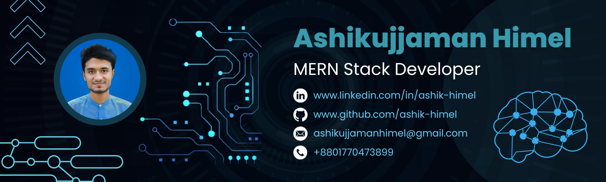

# 
Hi👋, &nbsp;I'm Ashik-Himel 👨‍💻
  
### 
MERN Stack Developer | Competitive Programmer

 

- 🧛‍♂️ All of my informations are available at https://ashik-himel.github.io
- 👨‍💻 All of my projects are available at https://github.com/Ashik-Himel?tab=repositories
- 🌍 My Linekdin profile https://www.linkedin.com/in/ashik-himel
- 📫 You can reach me via ashikujjamanhimel@gmail.com
  

## 🌐 Connect with me

 

## 🚀 Skills
                     
  

## 👨‍💻 Top Projects
| **Project Name** | **Project Features**                                                                                                            | **Repository**                                              | **Preview**                                         |
|------------------|---------------------------------------------------------------------------------------------------------------------------------|-------------------------------------------------------------|-----------------------------------------------------|
| Brand Shop       | Cart functionality based on user, Products and categories load from database, User login and register, Private route pages | [Repo Link](https://github.com/Ashik-Himel)                 | [Live Link](https://brand-shop-1.web.app/)          |
| Dragon News      | News load dynamically from json file, News based on category, User login and register, Private route pages                 | [Repo Link](https://github.com/Ashik-Himel/the-dragon-news) | [Live Link](https://react-dragon-news.netlify.app/) |
 

## 📊 GitHub Stats:
 
 
